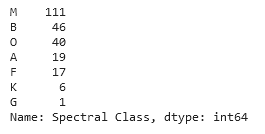

# ACM Research coding challenge (Spring 2023)

## Matthew Hui

I came into this challenge with only basic understanding of Python syntax and programming and very minimal familiarity with data-analysis libraries like pandas and seaborn. I spent between about three to four hours on this in total and elected to follow a three-step process:

1. Perform any necessary data cleaning
2. Find patterns/correlations in data
3. Create visualizations of information

# Process & Images

I generally like looking at, analyzing, and thinking about appealing visualizations, so I naturally wanted to learn more about how to create them.

After following the Kaggle data visualizations course closely up to and through the scatterplots section, I began looking at the dataset. I then moved onto visual analysis.

I found that the most common spectral type of stars in the data set was the class 'M'.

Then, I moved on to the main part of my challenge--creating the Hertzsprung-Russell diagram. This is the most common diagram used to visualize and interpret data related to star properties:

## Considerations

I would say that I achieved my goal of creating an informative visualization of the data. I was able to perform observation on the dataset itself, manipulate it to what I needed, and make something new with it. 

If I were to complete this challenge again, I would spend more time trying to make my Hertzsprung-Russell diagram interactive and more visually detailed.

## References

The following are links to reference sites I used to help me complete this challenge.

- https://www.kaggle.com/learn/data-visualization?rvi=1
- https://matplotlib.org/stable/tutorials/colors/colors.html
- https://imagecolorpicker.com/en
